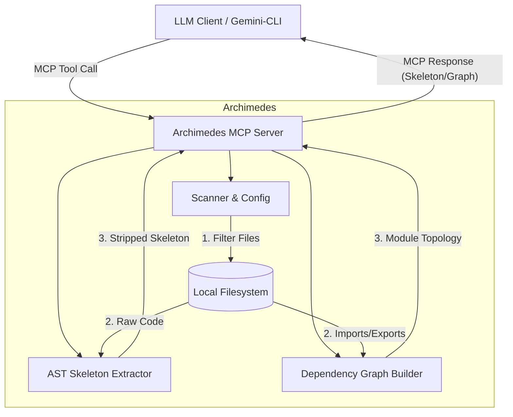

# Archimedes
**Archimedes** is a minimalist, high-performance local [Model Context Protocol (MCP)](https://modelcontextprotocol.io/) server designed to serve as "X-ray glasses" for Large Language Models (LLMs). 

It allows LLMs to instantly grasp the architecture of large Python codebases by dynamically stripping away implementation details and returning only the "skeleton"—function signatures, class definitions, and docstrings—along with a rich dependency graph.

## 🏗 Architecture



## 🚀 Core Features

-   **Skeleton Extraction**: Uses Python's native `ast` to surgically remove code bodies while preserving interfaces and docstrings.
-   **Dependency Graphing**: Builds a structural map of the codebase using `rustworkx`, showing how modules interact through imports.
-   **Real-time Memory Caching (Watchdog)**: Runs a background observer to detect file changes instantly. The codebase skeleton and structural hashes are kept in memory, dropping query latency to near zero.
-   **Structural Hashing**: Calculates hashes based *only* on the skeleton, allowing clients to detect meaningful interface changes while ignoring logic-only updates.
-   **Context Efficiency**: Dramatically reduces Token usage by stripping "the meat" (logic) and keeping "the bone" (structure).
-   **Smart Scanning**: Git-aware file filtering via `archimedes.yaml` to exclude virtual environments, caches, and tests.

## 🛠 Tech Stack

-   **Language**: Python 3.10+
-   **Package Manager**: `uv`
-   **MCP Framework**: `mcp` (FastMCP)
-   **Core Parser**: Native `ast`
-   **Graph Engine**: `rustworkx`
-   **File Monitoring**: `watchdog`
-   **Filtering**: `pathspec` (gitignore-style matching)

## 📦 Installation

Ensure you have [uv](https://github.com/astral-sh/uv) installed.

```bash
# Clone the repository
git clone https://github.com/your-username/archimedes.git
cd archimedes

# Sync dependencies and create virtual environment
uv sync
```

## ⚙️ Configuration

Create an `archimedes.yaml` in your target project's root to control which files are scanned:

```yaml
version: "1.0"
project_name: "MyProject"

indexing:
  include:
    - "src/**/*.py"
  exclude:
    - "tests/**"
    - "**/__pycache__/**"
    - "venv/**"
    - ".venv/**"
    - ".git/**"
```

## 🛠 MCP Tools Provided

### 1. `get_dependency_graph()`
Returns the project's macro architecture as a JSON Dependency Graph. Nodes represent modules (with their exports), and edges represent import relationships. Uses a **lazy-loading** strategy: the graph is only rebuilt if the underlying file structure has changed since the last call.

### 2. `get_codebase_skeleton()`
Returns a concatenated string of all Python file skeletons. Served directly from the **in-memory state in O(1) time**. Each file includes a structural hash, and the response contains a `GLOBAL_STRUCTURAL_HASH` for client caching.

### 3. `check_cache_status()`
Calculates the global structural hash of the codebase. Served directly from the **in-memory state in O(1) time**. Clients can use this to verify if their cached version of the skeleton is still valid without downloading the full content.

### 4. `read_full_implementation(file_path: str)`
Reads the full source code of a specific file. Use this after identifying a file of interest via the skeleton or graph tools.

## ⌨️ Local Usage

To start the MCP server over standard input/output (stdio):

```bash
uv run python -m archimedes.server
```

## 🧪 Testing & Linting

We maintain a robust test suite covering AST transformation, configuration parsing, graph building, and server logic, alongside strict code style checking with `ruff`.

```bash
# Run the linter
uv run ruff check .

# Run the test suite
uv run pytest
```

## 🗺 Roadmap

-   **V2.1**: Advanced edge resolution (matching imports to specific functions/classes).
-   **Multi-language Support (V3)**: Abstract the parser layer to support languages beyond Python (e.g., TypeScript, Go, Java) using language-specific AST visitors.
-   **Gemini Context Caching**: Native integration with `cachedContents` API to achieve zero-token project loads.
-   **Interactive Visualizer**: A lightweight web UI to browse the dependency graph.

## 📄 License

MIT
