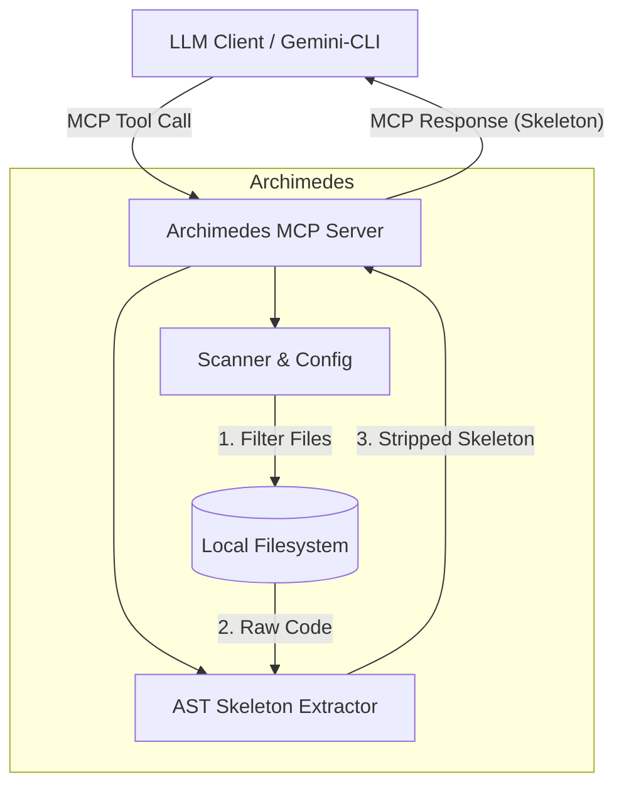

# Archimedes

**Archimedes** is a minimalist, high-performance local [Model Context Protocol (MCP)](https://modelcontextprotocol.io/) server designed to serve as "X-ray glasses" for Large Language Models (LLMs). 

It allows LLMs to instantly grasp the architecture of large Python codebases by dynamically stripping away implementation details and returning only the "skeleton"—function signatures, class definitions, and docstrings.

## 🏗 Architecture



## 🚀 Core Features

-   **Skeleton Extraction**: Uses Python's native `ast` (Abstract Syntax Tree) to surgically remove code bodies while preserving interfaces.
-   **Context Efficiency**: Dramatically reduces Token usage by stripping "the meat" (logic) and keeping "the bone" (structure).
-   **Smart Scanning**: Git-aware file filtering via `archimedes.yaml` to exclude virtual environments, caches, and tests.
-   **Seamless Integration**: Built with `FastMCP` for easy use with `gemini-cli` and other MCP clients.

## 🛠 Tech Stack

-   **Language**: Python 3.10+
-   **Package Manager**: `uv`
-   **MCP Framework**: `mcp` (FastMCP)
-   **Core Parser**: Native `ast`
-   **Filtering**: `pathspec` (gitignore-style matching)

## 📦 Installation

Ensure you have [uv](https://github.com/astral-sh/uv) installed.

```bash
# Clone the repository
git clone https://github.com/your-username/archimedes.git
cd archimedes

# Sync dependencies and create virtual environment
uv sync
```

## ⚙️ Configuration

Create an `archimedes.yaml` in your target project's root to control which files are scanned:

```yaml
version: "1.0"
project_name: "MyProject"

indexing:
  include:
    - "src/**/*.py"
  exclude:
    - "tests/**"
    - "**/__pycache__/**"
    - "venv/**"
    - ".venv/**"
    - ".git/**"
```

## 🛠 MCP Tools Provided

### 1. `get_codebase_skeleton(target_dir: str = ".")`
Scans the specified directory and returns a concatenated string of all Python file skeletons. This is the "macro view" for the LLM.

### 2. `read_full_implementation(file_path: str)`
Reads the full source code of a specific file. Use this after identifying a file of interest via the skeleton tool for deep-dive analysis or refactoring.

## ⌨️ Local Usage

To start the MCP server over standard input/output (stdio):

```bash
uv run python -m archimedes.server
```

## 🧪 Testing

We maintain a robust test suite covering AST transformation, configuration parsing, and server logic.

```bash
uv run pytest
```

## 🗺 Roadmap

-   **V2.0**: Structural Hashing & SQLite integration for intelligent caching.
-   **Gemini Context Caching**: Native integration with `cachedContents` API to achieve zero-token project loads.

## 📄 License

MIT
