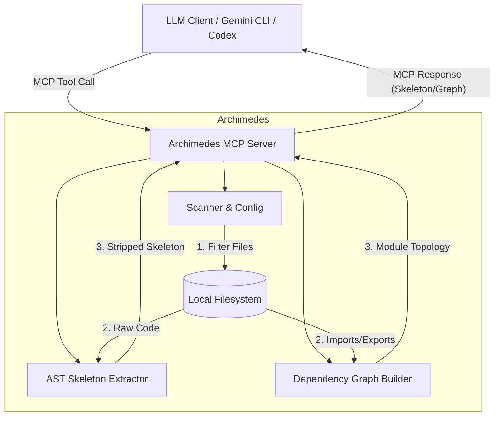

# Archimedes
**Archimedes** is a minimalist, high-performance local [Model Context Protocol (MCP)](https://modelcontextprotocol.io/) server designed to serve as "X-ray glasses" for Large Language Models (LLMs).

It allows LLMs to instantly grasp the architecture of large Python codebases by dynamically stripping away implementation details and returning only the "skeleton"—function signatures, class definitions, and docstrings—along with a rich dependency graph.

## 🏗 Architecture



## 🚀 Core Features

-   **Skeleton Extraction**: Uses Python's native `ast` to surgically remove code bodies while preserving interfaces and docstrings.
-   **Dependency Graphing**: Builds a structural map of the codebase using `rustworkx`, including absolute imports, relative imports, `src/`-layout package aliases, package `__init__.py` modules, and merged import edges.
-   **Real-time Memory Caching (Watchdog)**: Runs a background observer to detect file changes instantly. The codebase skeleton and structural hashes are kept in memory, dropping query latency to near zero.
-   **Structural Hashing**: Calculates hashes based *only* on the skeleton, allowing clients to detect meaningful interface changes while ignoring logic-only updates.
-   **Context Efficiency**: Dramatically reduces Token usage by stripping "the meat" (logic) and keeping "the bone" (structure).
-   **Configurable Scanning**: `archimedes.yaml` uses gitignore-style exclude patterns to skip virtual environments, caches, tests, and other noisy paths.

## 🛠 Tech Stack

-   **Language**: Python 3.10+
-   **Package Manager**: `uv`
-   **MCP Framework**: `mcp` (FastMCP)
-   **Core Parser**: Native `ast`
-   **Graph Engine**: `rustworkx`
-   **File Monitoring**: `watchdog`
-   **Filtering**: `pathspec` (gitignore-style matching)

## 📦 Installation

Ensure you have [uv](https://github.com/astral-sh/uv) installed.

```bash
# Clone this repository
git clone https://github.com/Flying-Henanese/graph-mcp.git
cd graph-mcp

# Sync dependencies and create virtual environment
uv sync
```

## ⚙️ Configuration

Create an `archimedes.yaml` in your target project's root to control which files are scanned:

```yaml
version: "1.0"
project_name: "MyProject"

indexing:
  include:
    - "src/**/*.py"
  exclude:
    - "tests/**"
    - "**/__pycache__/**"
    - "venv/**"
    - ".venv/**"
    - ".git/**"
```

Only Python files matching `include` patterns are indexed. Matching files are then filtered by `exclude` patterns.

## 🛠 MCP Tools Provided

### 1. `get_dependency_graph()`
Returns the project's macro architecture as a JSON Dependency Graph. Nodes represent modules (with their exports), and edges represent import relationships. Uses a **lazy-loading** strategy: the graph is rebuilt when the cached structural state has changed; otherwise, the cached JSON is returned.

### 2. `get_codebase_skeleton()`
Returns a concatenated string of all Python file skeletons. Served directly from the **in-memory state in O(1) time**. Each file includes a structural hash, and the response contains a `GLOBAL_STRUCTURAL_HASH` for client caching.

### 3. `check_cache_status()`
Calculates the global structural hash of the codebase. Served directly from the **in-memory state in O(1) time**. Clients can use this to verify if their cached version of the skeleton is still valid without downloading the full content.

### 4. `read_full_implementation(file_path: str)`
Reads the full source code of a specific file. Use this after identifying a file of interest via the skeleton or graph tools.

### 5. `get_context_manifest()`
Returns a provider-neutral manifest of cacheable context blocks. Clients can compare block hashes before deciding whether to fetch large context payloads.

### 6. `get_context_block(block_id: str)`
Returns a specific cacheable context block. The current block ids are `codebase_skeleton` and `dependency_graph`.

## 🧠 Cache Model

Archimedes currently implements caching inside the MCP server, plus cache-friendly metadata for LLM clients:

-   On startup, `watchdog` scans the project, extracts skeletons, and stores skeletons and structural hashes in memory.
-   On file creation, modification, or deletion, the in-memory `ProjectState` is updated and the dependency graph cache is marked dirty.
-   `check_cache_status()` returns the current `GLOBAL_STRUCTURAL_HASH`, allowing clients such as Gemini CLI, Codex, or custom wrappers to decide whether their local skeleton cache is still valid.
-   `get_context_manifest()` and `get_context_block()` expose the same context as stable, hash-addressed blocks for provider-neutral cache adapters.
-   The structural hash is based on the skeleton, not the full implementation, so logic-only changes do not invalidate the skeleton cache.

Archimedes does **not** currently create Gemini `cachedContents` entries or manage provider-side LLM cache IDs. Native provider cache integration is planned as future work.

## 📊 Token Experiments

The repository includes a small Gemini CLI A/B script for comparing Archimedes MCP context against direct repository reads:

```bash
# Configure Gemini CLI with the Archimedes MCP server, then run one A/B sample
scripts/gemini_token_ab.sh --setup-mcp --runs 1

# Use an already-configured MCP server
scripts/gemini_token_ab.sh --runs 1

# Pick a specific Gemini model
MODEL=gemini-2.5-flash scripts/gemini_token_ab.sh --runs 1
```

The script writes raw Gemini output and a parsed summary under `.tmp/gemini-token-ab/`. Different Gemini CLI versions expose usage fields differently, so the raw logs are kept even when token fields cannot be parsed automatically.

## ⌨️ Local Usage

To start the MCP server over standard input/output (stdio):

```bash
uv run python -m archimedes.server
```

## 🧪 Testing & Linting

We maintain a robust test suite covering AST transformation, configuration parsing, graph building, server logic, context block metadata, and watcher behavior, alongside strict code style checking with `ruff`.

```bash
# Run the linter
uv run ruff check .

# Run the test suite
uv run pytest
```

## 🔭 Vision: Multi-Granularity X-Ray (Progressive Disclosure)

Archimedes is evolving to solve the "One-size-fits-all" context problem. Supplying an entire codebase skeleton is perfect for deep refactoring, but it can be overkill for high-level architectural queries (which causes unnecessary Token bloat). 

To maximize Token ROI, our architecture embraces a **Multi-Granularity** "Zoom Lens" approach:
-   **L1: System/Infrastructure (Macro)**: Parsing `docker-compose.yml` (and eventually K8s configs) to provide a bird's-eye view of microservices, ports, and external dependencies. *(Highest Priority)*
-   **L2: Module Dependency (Mid-Macro)**: The current `rustworkx` import graph mapping file-to-file relationships.
-   **L3: Interface Skeleton (Mid-Micro)**: The current AST-based extraction of class and function signatures.
-   **L4: Deep Call Graph (Micro)**: Function-level internal call tracing. *(Lowest Priority: Best handled by the LLM natively using file reads on targeted files).*

By prioritizing **L1 (System Layer)**, Archimedes will allow AI agents to instantly grasp the project's macro boundaries before diving into Python-specific modules.

## 🗺 Roadmap

-   **V2.1**: Advanced edge resolution (matching imports to specific functions/classes).
-   **V2.2**: L1 Infrastructure Awareness — Add support for parsing `docker-compose.yml` to extract top-level system architecture and service dependencies.
-   **Multi-language Support (V3)**: Abstract the parser layer to support languages beyond Python (e.g., TypeScript, Go, Java) using language-specific AST visitors.
-   **Provider Cache Adapters**: Optional integrations for provider-side caches such as Gemini `cachedContents` and OpenAI prompt caching.
-   **Interactive Visualizer**: A lightweight web UI to browse the dependency graph.

## 📄 License

MIT
