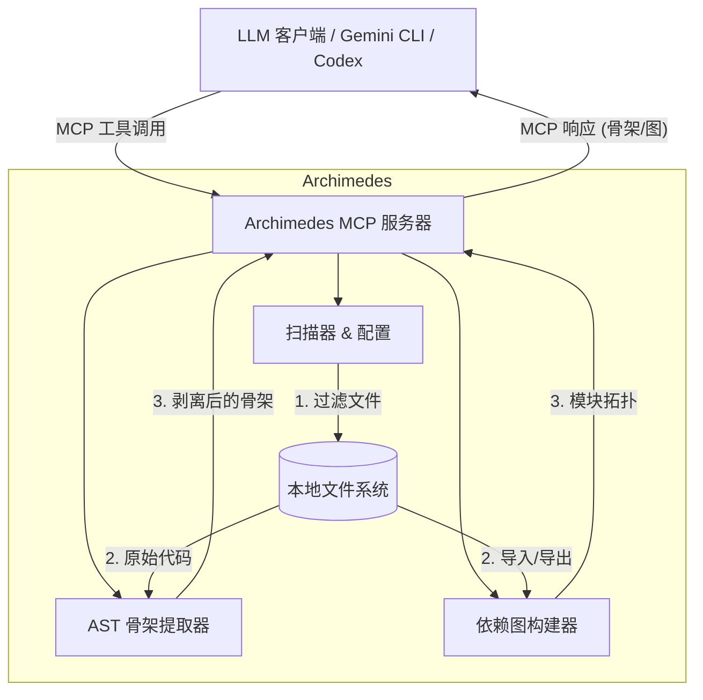

# Archimedes
**Archimedes** 是一个极简、高性能的本地 [Model Context Protocol (MCP)](https://modelcontextprotocol.io/) 服务器，旨在为大语言模型 (LLM) 提供代码库的“X 射线眼镜”。

它通过动态剥离 Python 代码的实现细节，仅返回“骨架（Skeleton）”——即函数签名、类定义和文档字符串——以及丰富的依赖图，让 LLM 能够瞬间掌握大型代码库的架构。

## 🏗 架构



## 🚀 核心特性

-   **骨架提取**：使用 Python 原生 `ast` 模块外科手术式地移除代码体，同时保留接口和文档字符串。
-   **依赖图谱**：使用 `rustworkx` 构建代码库的结构图，支持绝对导入、相对导入、`src/` 布局包别名、包级 `__init__.py` 模块以及合并后的 import 边。
-   **实时内存缓存 (Watchdog)**：在后台运行观察者以即时检测文件更改。代码库骨架和结构化哈希保存在内存中，将查询延迟降至接近于零。
-   **结构化哈希**：基于骨架内容计算哈希值，允许客户端识别有意义的接口变更，同时忽略仅涉及逻辑的更新。
-   **上下文效率**：通过“去肉留骨”大幅减少 Token 消耗。
-   **可配置扫描**：通过 `archimedes.yaml` 使用 gitignore 风格的排除规则，跳过虚拟环境、缓存、测试等噪声路径。

## 🛠 技术栈

-   **语言**：Python 3.10+
-   **包管理**：`uv`
-   **MCP 框架**：`mcp` (FastMCP)
-   **核心解析器**：原生 `ast`
-   **图引擎**：`rustworkx`
-   **文件监控**：`watchdog`
-   **路径过滤**：`pathspec` (gitignore 风格匹配)

## 📦 安装

请确保已安装 [uv](https://github.com/astral-sh/uv)。

```bash
# 克隆当前仓库
git clone https://github.com/Flying-Henanese/graph-mcp.git
cd graph-mcp

# 同步依赖并创建虚拟环境
uv sync
```

## ⚙️ 配置

在目标项目的根目录下创建 `archimedes.yaml` 以控制扫描范围：

```yaml
version: "1.0"
project_name: "MyProject"

indexing:
  include:
    - "src/**/*.py"
  exclude:
    - "tests/**"
    - "**/__pycache__/**"
    - "venv/**"
    - ".venv/**"
    - ".git/**"
```

只有匹配 `include` 规则的 Python 文件会进入索引，随后再应用 `exclude` 规则进行排除。

## 🛠 提供的 MCP 工具

### 1. `get_dependency_graph()`
返回项目的宏观架构（JSON 格式的依赖图）。节点代表模块（及其导出项），边代表导入关系。采用**懒加载**策略：当缓存中的结构状态发生变化时重建依赖图，否则直接返回已缓存的 JSON。

### 2. `get_codebase_skeleton()`
返回所有 Python 文件的骨架字符串。**以 O(1) 的时间复杂度直接从内存状态中读取**。每个文件都包含一个结构哈希，响应中包含用于客户端缓存的 `GLOBAL_STRUCTURAL_HASH`。

### 3. `check_cache_status()`
计算代码库的全局结构哈希。**以 O(1) 的时间复杂度直接从内存状态中读取**。客户端可以使用此哈希验证其缓存的骨架是否仍然有效，而无需下载完整内容。

### 4. `read_full_implementation(file_path: str)`
读取特定文件的完整源码。通过骨架或依赖图工具定位到感兴趣的文件后，使用此工具进行深度分析。

### 5. `get_context_manifest()`
返回与供应商无关的可缓存上下文块清单。客户端可以先比较块哈希，再决定是否拉取较大的上下文内容。

### 6. `get_context_block(block_id: str)`
返回指定的可缓存上下文块。当前支持的块 ID 是 `codebase_skeleton` 和 `dependency_graph`。

## 🧠 缓存模型

Archimedes 当前实现的是 MCP 服务端内部缓存，并向 LLM 客户端提供便于缓存校验的元数据：

-   启动时，`watchdog` 扫描项目，提取代码骨架，并把骨架和结构哈希保存到内存状态中。
-   当文件创建、修改或删除时，内存中的 `ProjectState` 会被实时更新，同时依赖图缓存会被标记为需要重建。
-   `check_cache_status()` 返回当前 `GLOBAL_STRUCTURAL_HASH`，Gemini CLI、Codex 或自定义客户端可以用它判断本地缓存的骨架是否仍然有效。
-   `get_context_manifest()` 和 `get_context_block()` 将同一份上下文暴露为稳定、带哈希的上下文块，方便后续接入不同供应商的缓存适配器。
-   结构哈希基于骨架而不是完整实现，所以仅修改函数内部逻辑通常不会让骨架缓存失效。

Archimedes 目前**不会**创建 Gemini `cachedContents`，也不会管理供应商侧的 LLM 缓存 ID。原生接入供应商缓存仍属于未来计划。

## 📊 Token 实验

仓库内置了一个 Gemini CLI A/B 测试脚本，用于比较 Archimedes MCP 上下文和直接读取仓库文件的 token 消耗：

```bash
# 为 Gemini CLI 配置 Archimedes MCP server，然后运行一轮 A/B 样本
scripts/gemini_token_ab.sh --setup-mcp --runs 1

# 使用已经配置好的 MCP server
scripts/gemini_token_ab.sh --runs 1

# 指定 Gemini 模型
MODEL=gemini-2.5-flash scripts/gemini_token_ab.sh --runs 1
```

脚本会把 Gemini 原始输出和解析后的摘要写入 `.tmp/gemini-token-ab/`。不同版本的 Gemini CLI 暴露 usage 字段的结构可能不同，因此即使无法自动解析 token 字段，原始日志也会被保留下来。

## ⌨️ 本地运行

通过标准输入/输出 (stdio) 启动 MCP 服务器：

```bash
uv run python -m archimedes.server
```

## 🧪 测试与代码规范

我们维护了完善的测试套件（涵盖 AST 转换、配置解析、图构建、服务器逻辑、上下文块元数据和 watcher 行为），并使用 `ruff` 强制执行严格的代码风格。

```bash
# 运行代码风格检查
uv run ruff check .

# 运行测试套件
uv run pytest
```

## 🗺 路线图

-   **V2.1**：高级边解析（将导入匹配到具体的函数/类）。
-   **多语言支持 (V3)**：通过抽象解析层，实现对 Python 以外语言（如 TypeScript, Go, Java）的支持。
-   **供应商缓存适配器**：可选接入 Gemini `cachedContents`、OpenAI prompt caching 等供应商侧缓存能力。
-   **交互式可视化**：用于浏览依赖图的轻量级 Web 界面。

## 📄 开源协议

MIT
